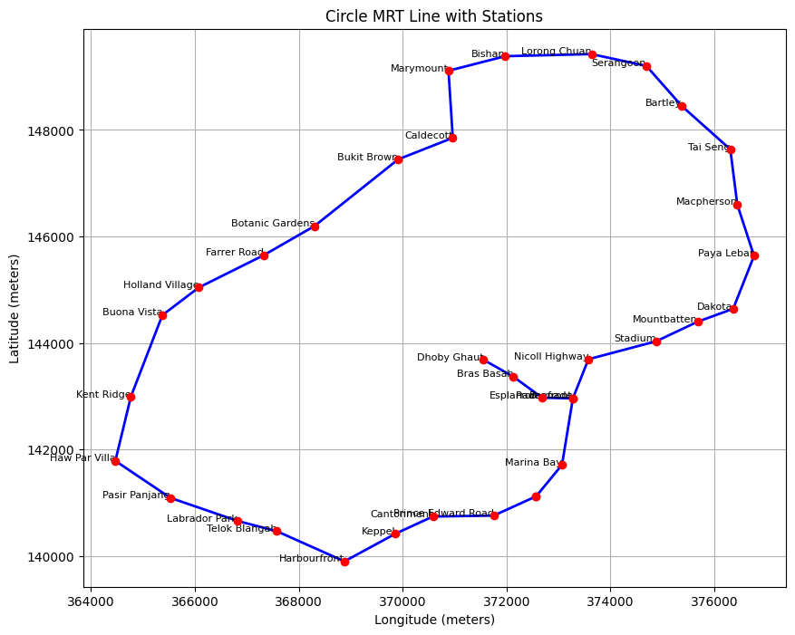
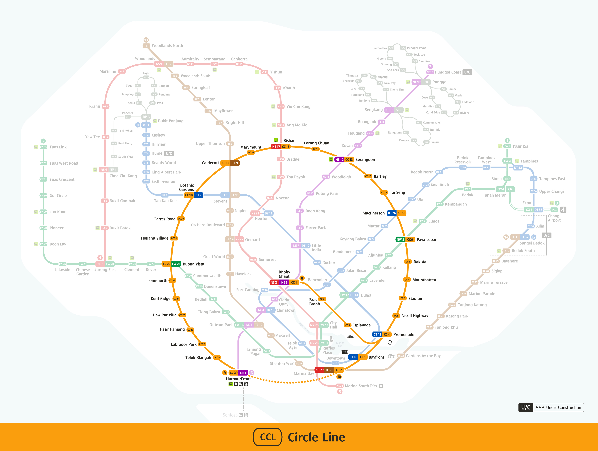
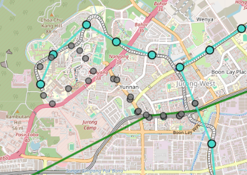

# Technical Report

**Project: Identifying Parallel Bus and Train Routes**  
**Members: Anthea, Jing Jie, Guhanavel, Kiley**

**Last updated on 06 November 2024**

## Section 1: Context

Singapore’s public transport system is a highly integrated network that includes the Mass Rapid Transit (MRT) system and a variety of bus services. The MRT serves as the backbone, offering fast, high-capacity rail transport across the island, while bus services include trunk services for longer, inter-town routes and feeder services that connect neighbourhoods to nearby MRT stations, ensuring comprehensive last-mile connectivity.

In recent years, the Land Transport Authority (LTA) and the Ministry of Transport (MOT) have introduced several MRT lines, such as the Downtown Line and the Thomson-East Coast Line, intending to improve the accessibility, reliability, and efficiency of the public transport system for Singapore's commuters. These additions aim to reduce reliance on traditional trunk bus services, which are generally slower and less predictable for longer journeys.


*Bus Route 167 is an example of a trunk service. This bus route was deemed to have high overlap with a portion of the new Thomson-East Coast MRT line.*

With the introduction of new MRT lines, it has been observed that demand for certain trunk bus services has decreased. To optimise public transport offerings, LTA aims to streamline these services, encouraging commuters to utilise the new MRT lines instead of the overlapping trunk bus services. Given budget constraints for subsidising both bus and MRT routes, MOT must reallocate resources to better meet commuter needs.

Currently, the process for identifying overlapping services is labor-intensive, as it relies on manual inspections, anecdotal evidence, or small-scale surveys. LTA therefore seeks the Data Science Department’s assistance in developing a systematic approach to identify trunk bus services that significantly overlap with MRT lines and should be prioritized for reallocation.


## Section 2: Scope

### 2.1 Problem
The project aims to conduct an in-depth study to identify which bus routes are parallel to MRT lines and redundant across Singapore. Previous assessments have relied on small-scale surveys and anecdotal evidence, which are insufficient for understanding the true extent of redundancy. By performing comprehensive data analysis, this project seeks to determine where overlap exists (parallel routes) and identify which bus services can be optimised.

This issue affects the Ministry of Transport's (MOT) Land Division, which is responsible for planning and optimising bus routes. Manually identifying these parallel routes is complex and time-consuming, making it challenging to efficiently optimise resource use. The project aims to assist MOT by systematically identifying redundancies, thus improving productivity and ensuring effective public transport planning.

This project also benefits the Land Transport Authority (LTA), which operationalises these routes. By optimising and removing redundant services, LTA can save resources and reallocate them to underserved areas, ultimately helping the public by ensuring convenient and balanced access to public transportation.

Solving this problem has significant potential for cost savings and improved public service delivery. Without correctly identifying and addressing redundant routes, operational costs will remain high, and underserved areas will continue to lack adequate transportation. By addressing these inefficiencies, better coverage can be provided to areas that require bus services more.

Data science is an appropriate solution as it can map out a systematic process to quickly and accurately compare bus and MRT routes. This enables a process that is more efficient and scalable to identify redundancies. This project leverages geospatial and statistical methods to automate the identification process, ensuring a more efficient and accurate solution.

### 2.2 Success Criteria

For this project, we consider the following factors as success criteria in the business and operational domains:

#### Success Criteria 1: Cost Savings from Route Optimization (Business Goal)

Success is achieved by identifying and streamlining at least 2-3 bus routes with significant overlap with existing MRT lines. By identifying and modifying such routes, LTA would be able to potentially reduce operational costs, allowing for budget reallocation to underserved routes.

#### Success Criteria 2: Increased Public Satisfaction of Public Transport (Business Goal)

An important metric for evaluating success is the level of public satisfaction with the public transport system. As LTA is a public agency, it is important to maintain good public sentiment and ensure that the needs of commuters are being met. By examining ridership trends and patterns over a three-month period, we can estimate the extent to which the proposed changes meet commuters' needs, enhance convenience, and ultimately improve satisfaction. Given the time needed for commuters to adapt to the new routes and transportation options, this three-month period allows for a more accurate assessment of the adjustments’ impact.

#### Success Criteria 3: Efficient and Accurate in Identifying Overlapping Routes (Operational Goal)

Next, success is defined by the project's ability to develop a systematic approach that improves the accuracy and speed of identifying overlapping bus and MRT routes. This metric is measured by comparing the proposed method with the existing process of manual identifying overlapping routes. The proposed approach is considered to be an efficient and accurate method if there is a 50% improvement in time and accuracy of identification.

#### Success Criteria 4: Scalability for Future Planning (Operational Goal)

Another measurement of success is the scalability and adaptability of the approach for future MRT expansions and other planning needs. Instead of being a one-off process, the solution should be flexible and robust enough to accommodate new routes and upcoming train lines such as the Jurong Region Line or Cross Island Line.  The proposed method should remain relevant and effective as the public transport network expands.

### 2.3 Assumptions
Given the technical limitations, we rely on certain assumptions and conditions in developing the project. If these assumptions are altered, it may affect the accuracy and effectiveness of the proposed algorithm.

#### Assumption 1: Exclusion of Transfers  
Given the project timeline and complexity, we assumed that transfers between bus routes and MRT lines (e.g., transferring from one bus to another or from one MRT line to another) would not be considered in this analysis. This simplifies the scope by focusing solely on direct overlaps between single bus routes and MRT lines rather than multi-route journeys which introduces more variability in our analysis.

#### Assumption 2: Publicly Available Data Sufficiency  
There was a lack of access to detailed ridership data for individual bus and train routes. In addition we were unable to cross verify the accuracy of the reported ridership, bus and train coordinates from the publicly available datasets. Hence we assumed that these data are up-to-date and consistent with the current ridership trends. If these datasets are outdated or inconsistently updated, this could lead to misrepresentation of current demand, affecting the reliability of the recommendations.

#### Assumption 3: Absence of Delay and Disruption
We assume that all bus and train datasets are free from any records of disruptions, delays, or anomalies that could skew demand estimates. For instance, events such as the 2024 September disruption on the East-West Line are assumed to be excluded or have negligible impact on the provided data. If disruptions or irregularities were present, they could artificially inflate or deflate demand estimates, leading to inaccurate conclusions about which services may be redundant or require adjustment.


## Section 3: Methodology

### 3.1 Technical Assumptions

#### Assumption 1: Data Completeness and Structure of MRT Lines:
Due to limitations in publicly available data from LTA Data Mall, the MRT line data lacked specific station names and line identifiers (e.g., North East Line). 


*Screenshot of MRT LineString Data found in [Parallel_Route.ipynb](geospatial%2FParallel_Route.ipynb)*

Hence, we approximated MRT LineStrings by connecting stations in sequence, resulting in a "rigid" representation with straight segments between stations (as shown in the example image). While this approach does not capture the actual curvature of the routes, we assume that it provides a sufficiently accurate approximation for our analysis, as MRT trains typically follow a direct path between stations with minimal deviation.

|  |  |
|--------------------------------------------------|------------------------------------------------------|
| *Circle Line Representation in LineStrings Data* | *Actual Representation of Circle Line.*              |

#### Assumption 2: What constitutes a parallel route?

In this analysis, a bus route is considered "parallel" to an MRT line if it meets the following criteria:

1. **Distance Proximity**: The bus route falls within a 500-metre buffer zone around the MRT line, ensuring that it serves a similar geographical area and commuter base.
2. **Spatial Overlap**: The bus route consistently overlaps with the MRT line along parts of its path. This is assessed by dividing both the bus and MRT routes into 1 km segments and checking for consecutive intersections.
3. **Path Alignment (Angular Deviation)**: The bus route follows a similar direction to the MRT line with minimal angular deviation. Smaller angular deviations (near 0°) indicate alignment, while larger deviations (45° or more) indicate divergence. For a route to be considered parallel, the average angular deviation should be minimal, showing that the bus route is closely aligned with the MRT line.

Rather than setting fixed thresholds for consecutive intersections and average angular deviations, we will use a weighted scoring system as free parameters to identify parallel routes. This approach allow us to accounts for variations in factors like population density and connectivity, which are factors that affects the final results.

#### Assumption 3: Bus Frequency will accurately reflect the proportion of trips:
Due to the lack of access to detailed ridership data for individual bus and train routes, this project relies on publicly available datasets from the LTA Datamall for calculations. However, these datasets do not provide trip figures for specific bus routes; rather, they show the number of trips from a particular origin and destination bus stops.


*Screenshot of BusTrips between Origin and Destination Bus stop found in [03_Trip Modelling.ipynb](ridership%2F03_Trip%20Modelling.ipynb)*

Hence, we were required to rely on bus frequency data to estimate the proportion of trips occurring between the origin and destination bus stops to model the ridership trends.


*Screenshot of BusFrequency Dataset used found in [03_Trip Modelling.ipynb](ridership%2F03_Trip%20Modelling.ipynb)*

This assumption was helpful in simplify our calculation of ridership demand to model a robust recommendation system.

#### Assumption 4: Bus’ direction has a negligible effect on its route:
During our analysis of bus routes, we realised that the direction of the bus route has negligible effect on the route of the bus. In the example of bus service 18 below, both directions of the bus move along the same route with regards to its location. We will also assume that ridership demand for both directions will be similar because of this.


*Bus Service 18 route for both directions*

### 3.2 Data

#### 3.2.1 Data Extraction & Collection:
We used publicly available datasets from LTA Data Mall, including bus routes, bus stops, and MRT station locations.
Below is a list of raw datasets we used in our calculations with a one-liner description of each dataset. To extract the datasets, we ran the notebook **[get_data.ipynb](data%2Fget_data.ipynb)** from the data folder. The table below displays all datasets called.

| **Name of Dataset**                        | **File Type**          | **Description**                                                                                              | **Method of Extraction**                                                                                                                          |
|:-------------------------------------------|:------------------------|:-------------------------------------------------------------------------------------------------------------|:--------------------------------------------------------------------------------------------------------------------------------------------------|
| BusRoutes.json                             | .json                  | Detailed route information for all services currently in operation, including: all bus stops along each route, first/last bus timings for each stop. | **[get_data.ipynb](data%2Fget_data.ipynb)**                                                                                                       |
| BusStopLocation_Jul2024                    | Folder with .shp file  | Provides the geo coordinates of all bus stops in Singapore                                                   | **[get_data.ipynb](data%2Fget_data.ipynb)**                                                                                                       |
| BusServices.json                           | .json                  | Contains data of each bus route frequency and type of service                                                | **[LTA Data Mall site](https://datamall.lta.gov.sg/content/dam/datamall/datasets/PublicTransportRelated/BusServices.zip)**                        |
| transport_node_bus_202407.csv              | .csv                   | Provides ridership of buses for the month of Jul 2024                                                        | **[get_data.ipynb](data%2Fget_data.ipynb)**                                                                                                       |
| transport_node_bus_202408.csv              | .csv                   | Provides ridership of buses for the month of Aug 2024                                                        | **[get_data.ipynb](data%2Fget_data.ipynb)**                                                                                                       |
| transport_node_bus_202409.csv              | .csv                   | Provides ridership of buses for the month of Sept 2024                                                       | **[get_data.ipynb](data%2Fget_data.ipynb)**                                                                                                       |
| TrainStationExits.geojson                  | .geojson               | Provides the geographical coordinates of all train station exits in Singapore.                               | **[get_data.ipynb](data%2Fget_data.ipynb)**                                                                                                       |
| Train Station Codes and Chinese Names.xls  | .xls                   | List of Train Station Names, Codes, and Chinese Names. Used in tagging the stations                          | **[LTA DataMall site](https://datamall.lta.gov.sg/content/dam/datamall/datasets/Geospatial/Train%20Station%20Codes%20and%20Chinese%20Names.zip)** |
| MasterPlan2019RailStationLayer.geojson     | .geojson               | Provides the geo coordinates of all rail stations in Singapore (both present and future)                     | **[get_data.ipynb](data%2Fget_data.ipynb)**                                                                                                       |
| MasterPlan2019RailLineLayer.geojson        | .geojson               | Provides the geo coordinates of all rail lines in Singapore (both present and future)                        | **[get_data.ipynb](data%2Fget_data.ipynb)**                                                                                                       |
| MasterPlan2019PlanningAreaBoundary.geojson | .geojson               | Outlines the planning area boundaries across Singapore.                                                      | **[get_data.ipynb](data%2Fget_data.ipynb)**                                                                                                       |
| origin_destination_bus_202408.csv          | .csv                   | Provides total trip data from Bus Stop A to B.                                                               | **[get_data.ipynb](data%2Fget_data.ipynb)**                                                                                                       |

#### 3.2.2 Data Cleaning, Feature Engineering:

##### Part 1: Geospatial Data

All Geosptial Data was cleaned in **[clean_geosptial_data.ipynb](data%2Fclean_geosptial_data.ipynb)**. However, during the experimentation phase some data were required to be reformated and intermediate cleaning were done. Below is a summary of the handling of Geosptial Datasets


**Bus Stop & Routes Data**

We converted our BusStopLocation_Jul2024.shp files into .geojson to enable ease of working with .geojson files for both rail and bus lines in **[clean_geosptial_data.ipynb](data%2Fclean_geosptial_data.ipynb)**.

```python
# Load the shapefile into a GeoDataFrame
BusStops: gpd.GeoDataFrame = gpd.read_file('raw/BusStopLocation_Jul2024/BusStop.shp')

# Ensure the GeoDataFrame is in the correct CRS (coordinate reference system)
# The .prj file indicates that the data is in SVY21, which is EPSG:3414
BusStops: gpd.GeoDataFrame = BusStops.to_crs(epsg=4326)  # Convert to WGS 84 (EPSG:4326) for Folium
BusStops['BUS_STOP_N'] = BusStops['BUS_STOP_N'].fillna(-1)
BusStops['BUS_STOP_N'] = BusStops['BUS_STOP_N'].replace("UNK", -1)
BusStops['BUS_STOP_N'] = BusStops['BUS_STOP_N'].astype(int)
BusStops.head()
```
During the experimentation phase, we realised the absence of geospatial data of bus routes for geospatial analysis. Hence, we merged bus routes with bus stop coordinates to obtain the geometry for each stop, dropping records without geometry and converting the data into a GeoDataFrame. This allowed us to form LineStrings representing the continuous path of each bus route by grouping stops by ‘ServiceNo’ and ordering them by ‘StopSequence’. This data-cleaning procedure in be found in **[Parallel_Route.ipynb](geospatial%2FParallel_Route.ipynb)**.

```python
## Merge Bus Stop Coordinates with Bus Routes
# Ensure that BusStopCode is of the same type for both DataFrames (string)
bus_stops['BusStopCode'] = bus_stops['BUS_STOP_N'].astype(str)
bus_routes['BusStopCode'] = bus_routes['BusStopCode'].astype(str)

# Merge bus_routes with bus_stops to get geometry for each bus stop
merged_bus_data = bus_routes.merge(bus_stops[['BusStopCode', 'geometry']], on='BusStopCode', how='left')

# Drop rows without geometry
merged_bus_data = merged_bus_data.dropna(subset=['geometry'])

# Convert to GeoDataFrame
bus_routes_geo = gpd.GeoDataFrame(merged_bus_data, geometry='geometry')
# bus_routes_geo.to_crs(3857)
bus_routes_geo.set_crs(epsg=32648, inplace=True,allow_override=True)
bus_routes_geo.head()

bus_routes_lines = (
    bus_routes_geo.groupby(['ServiceNo'])
    .apply(lambda x: LineString(x.sort_values('StopSequence')['geometry'].tolist()))
    .reset_index()
    .rename(columns={0: 'geometry'})
)
# Convert to GeoDataFrame
bus_routes_lines = gpd.GeoDataFrame(bus_routes_lines, geometry='geometry')
bus_routes_lines = bus_routes_lines.set_crs(epsg=32648)
print(bus_routes_lines.head())

## Visualise one bus route as an example
bs10 = bus_routes_lines[bus_routes_lines['ServiceNo']=='10']

bs10.plot()
plt.show()
```
|  |  |
|------------------------------------------------|------------------------------------|
| **bus_routes_geo Table**                       | **Example Line String Plot of Bus 10**       |

**MRT Rail Lines & Station Data**

For MRT stations, there was a lack of tagging and labelling of MRT lines. Hence, we used the `Train Station Codes and Chinese Names.xls` from DataMall to map the MRT station identifiers. For that, we have to create custom functions to map the train service lines in **[clean_geosptial_data.ipynb](data%2Fclean_geosptial_data.ipynb)**:
``` python
def get_train_service_lines(stn_code):
    mapping = {
        'NS': 'North-South',
        'EW': 'East-West',
        'CG': 'East-West',
        'NE': 'North-East',
        'CC': 'Circle',
        'CE': 'Circle',
        'DT': 'Downtown',
        'TE': 'Thomson East Coast',
        'BP': 'Bukit Panjang LRT',
        'ST': 'Sengkang LRT', # STC is Sengkang LRT
        'SE': 'Sengkang LRT',
        'SW': 'Sengkang LRT',
        'PW': 'Punggol LRT',
        'PE': 'Punggol LRT',
        'PT': 'Punggol LRT',  # PTC is Punggol LRT
    }
    # Split the station code if it contains multiple lines (e.g., NS1/EW24)
    lines = stn_code.split('/')
   
    # Look up the full name for each line prefix and collect the results
    full_lines = [mapping.get(line[:2], 'Unknown Line') for line in lines]
   
    # Return the list of full train service lines (you can return a list or a string)
    return full_lines
```
|  |  |
|----------------------------------------------------|--------------------------------------------------|
| **Raw MRT Station Table**                          | **MRT Station Tagged Table**                     |

On top of that, we standardised MRT station identifiers, removed duplicates (such as transfer stations with multiple entries), and projected the data to a consistent coordinate reference system (EPSG:32648) for spatial analysis. Due to missing line identifiers, we grouped stations by line and connected them sequentially using the Station Code to construct line strings for each MRT line.

```python
# Create sorted LineStrings for each MRT line group
for line_name, group in station_groups:
    line_strings_per_station_line[line_name] = []

    # Sort stations within each symbol group
    group['StationCodeNo'] = group['StationCode'].str[2:].astype(float)  # Extracts the station code number
    unique_symbols = group['StationCode'].str[:2].unique()  # Extract unique symbols

    for symbol in unique_symbols:
        symbol_group = group[group['StationCode'].str[:2] == symbol].sort_values('StationCodeNo')
        station_points = symbol_group.geometry.centroid.tolist()
        station_codes = symbol_group['StationCode'].tolist()
        station_names = symbol_group['StationName'].tolist()

        # Filter stations to ensure unique codes and handle specific cases
        filtered_points, filtered_names, filtered_codes = [], [], set()
        for point, code, name in zip(station_points, station_codes, station_names):
            if code not in filtered_codes and point is not None:
                filtered_points.append(point)
                filtered_names.append(name)
                filtered_codes.add(code)

        # Skip incomplete or single-station groups
        if len(filtered_points) > 1:
            mrt_line = LineString(filtered_points)
            line_strings_per_station_line[line_name].append({
                'LineString': mrt_line,
                'StationNames': filtered_names,
                'StationCodes': list(filtered_codes)
            })
```
*Disclamier this is a simplifed code, full code is in **[Parallel_Route.ipynb](geospatial%2FParallel_Route.ipynb)***


|  |  |
|--------------------------------------------------|-----------------------------------------------------|
| **MRT Linestrings Table**                        | **MRT Linestring Visualisation**                    |

##### Part 2: Ridership Data

All Ridership Data was cleaned in **[clean_ridership_data.ipynb](data%2Fclean_ridership_data.ipynb)**. However, during the experimentation phase some data were required to be reformated and intermediate cleaning were done. Below is a summary of the handling of Ridership Datasets


**Transport Node Datasets**


Transport Node datasets contains the tap in tap out data of each busstops. During the experiment stage, only one dataset `transport_node_bus_202409`.csv was used to test our hypothesis. For that we had to feature engineer 25th, 50th and 75th quartile data of the Tap-in, Tap-out volumes in **[01_ridership_exploration.ipynb](ridership%2F01_ridership_exploration.ipynb)**.

```python


average_ridership_by_stop = bus_ridership_202409.groupby(['TIME_PER_HOUR', 'DAY_TYPE']).agg({
    'TOTAL_TAP_IN_VOLUME': ['mean', lambda x: np.percentile(x, 25), lambda x: np.percentile(x, 75)],
    'TOTAL_TAP_OUT_VOLUME': ['mean', lambda x: np.percentile(x, 25), lambda x: np.percentile(x, 75)],
}).reset_index()
average_ridership_by_stop.columns = ['TIME_PER_HOUR', 'DAY_TYPE', 'TAP_IN_MEAN', 'TAP_IN_25', 'TAP_IN_75', 'TAP_OUT_MEAN', 'TAP_OUT_25', 'TAP_OUT_75']
```

With the hindsight that we will use 3-month datasets, there were merged in **[clean_ridership_data.ipynb](data%2Fclean_ridership_data.ipynb)**
```python
fnames = [
    "raw/transport_node_bus_202407.csv",
    "raw/transport_node_bus_202408.csv",
    "raw/transport_node_bus_202409.csv",
]

# Load all bus node files and concatenate them into a single dataframe
bus_node_df = pd.concat([pd.read_csv(fname) for fname in fnames], ignore_index=True)
print(bus_node_df.shape)
bus_node_df.head()

bus_node_df.to_csv('cleaned/BusRideVolume_2024_070809.csv', index=False)
```


For the final analysis, we used `BusRideVolume_2024_070809.csv` but the Tap-in and Tap-out data was averaged out.

```python
bus_ridership_quarter = bus_ridership_quarter.rename(columns={
     'PT_CODE':'Destination_Stop'
})

aggregated_ridership = bus_ridership_quarter.groupby(['DAY_TYPE', 'TIME_PER_HOUR', 'PT_TYPE', 'Destination_Stop']).agg({
     'TOTAL_TAP_IN_VOLUME': 'mean',
     'TOTAL_TAP_OUT_VOLUME': 'mean'
}).reset_index()
```
|  |  |
|--------------------------------------------------|------------------------------------------------------|
| **Monthly Tap-in Tap-out Table**                 | **Quarterly Combined Tap-in Tap-out Table**          |

**Trips Datasets**

To fulfill the 3rd assumption that bus frequency will accurately reflect the proportion of trips, bus origin destination data (`origin_destination_bus_202408.csv`) and `BusRoutes.json` were merged to identify total number of trips between 2 bus stops of the bus route.

|  |  |
|----------------------------------------------|------------------------------------------|
| **origin_destination_bus_202408.csv Table**  | **BusRoutes.json Table**                 |

These two datasets where merged by looking at each stop sequence in the BusRoute as a origin-destination pair and then do a inner join between the datasets.

**Function to identify origin-destination pair**

```python
# Sort by ServiceNo and StopSequence to ensure proper order
bus_routes_grouped = bus_routes.sort_values(by=['ServiceNo', 'Direction', 'StopSequence']).reset_index(drop=True)

# Initialize list to store origin-destination pairs
origin_destination_pairs = []

# Sliding window approach for each ServiceNo
for (service_no, direction), group in bus_routes_grouped.groupby(['ServiceNo', 'Direction']):
    group = group.reset_index(drop=True)
    
    for i in range(len(group) - 1):
        # Set current stop as origin and next stop as destination
        origin_stop = group.iloc[i]
        destination_stop = group.iloc[i + 1]
        
        origin_destination_pairs.append({
            'ServiceNo': service_no,
            'Direction': direction,
            'Origin_Stop': origin_stop['BusStopCode'],
            'Destination_Stop': destination_stop['BusStopCode'],
            'Origin_StopSequence': origin_stop['StopSequence'],
            'Destination_StopSequence': destination_stop['StopSequence']
        })

```

**Post Inner Join**


In addition, `BusServices.json` dataset was used to calculate the frequency of each bus at different timings and use that as an estimation to identify the proportion of trips contributed by the particular service. As the time frequency is given in minutes, a custom function was written to convert that to number of trips per hour as seen below:

```python
# Function to calculate average frequency from frequency range
def mean_frequency(freq):
    if freq == '-' or pd.isna(freq):
        return None  # Handle missing or empty frequencies
    # Split frequency range and convert to integers
    range_vals = list(map(int, freq.split('-')))
    return sum(range_vals) / 2  # Calculate the mean

# Apply mean calculation to each frequency column
bus_frequency['AM_Peak_Freq'] = bus_frequency['AM_Peak_Freq'].apply(mean_frequency)
bus_frequency['AM_Offpeak_Freq'] = bus_frequency['AM_Offpeak_Freq'].apply(mean_frequency)
bus_frequency['PM_Peak_Freq'] = bus_frequency['PM_Peak_Freq'].apply(mean_frequency)
bus_frequency['PM_Offpeak_Freq'] = bus_frequency['PM_Offpeak_Freq'].apply(mean_frequency)

bus_frequency = bus_frequency.fillna(0)
```
|  |  |
|------------------------------------|---------------------------------------------|
| **Before Mean Frequency Function** | **After Mean Frequency Function**           |

With this estimation, the frequency dataset was merged with the trips dataset to model the trips accurately in our experimentation.


### 3.3 Experimental Design

To develop a robust algorithm that accurately defines a parallel route, we used geospatial analysis as a primary method of identification and ridership analysis of the identified routes as a secondary method of analysis to determine if a route should be removed or rerouted. 

#### Primary Method of Identification: Geospatial Analytics

To systematically identify and evaluate parallel routes between bus and MRT lines, we designed a **three-phase approach** based on a clear progression of criteria to define parallelism as defined in our assumptions. In this context, defining "parallel" routes involves answering **three key questions**:

1. Are the bus and MRT routes near each other?
2. If so, how much do they overlap spatially?
3. How closely aligned or “parallel” are the paths of the two routes, based on angular deviation?

Each phase in our analysis addresses one of these questions, progressively narrowing down the routes and assessing the degree of parallelism. Detailed codes can be found in **[Parallel_Route.ipynb](geospatial%2FParallel_Route.ipynb)**.

**Phase 1: Initial Distance Proximity Check** 

**Rationale:** This phase aims to quickly filter out bus routes that do not intersect or are not close to MRT lines, reducing the number of routes that need more detailed analysis.  
**Process:** We created a buffer zone of 500 metres around each MRT line. Bus routes that did not intersect these buffer zones were excluded from further analysis. 500 meters radius was deemed reasonable walking distance from a bus stop to an MRT station. 

```python
#Check if any bus route is near any MRT line buffer
overlap_results = []

for line_name, mrt_buffer in mrt_buffers.items():
    for idx, bus_route in bus_routes_lines.iterrows():
        if bus_route.geometry.intersects(mrt_buffer):
            overlap_length = bus_route.geometry.intersection(mrt_buffer).length  # Get overlap length
            overlap_results.append({
                'MRT_Line': line_name,
                'Bus_ServiceNo': bus_route['ServiceNo'],
                'Bus_Route_Length_m': bus_route.geometry.length,  # Length of the bus route in meters
                'Overlap_Length_m': overlap_length  # Overlap length in meters
            })

overlap_df = pd.DataFrame(overlap_results)
```


**Phase 2: Segment Coverage Calculation**

**Rationale:** This phase aims to quantify the spatial overlap between each bus route and MRT line identified in Phase 1\.  
**Process:** We calculated spatial overlap into two sub-phases:

* **Phase 2.1**: MRT Segments and Bus Route
    * Each MRT line was segmented into 1 km sections, and we calculated the number of MRT segments that intersect with the bus route as a percentage of the number of MRT segments in the line. This provided an understanding of how much of the MRT line is covered by the bus route.

```python
# Iterate through each row in overlap_df_unique
for idx, row in overlap_df_unique.iterrows():
    # Fetch the geometry of the bus route (LineString) based on ServiceNo and Direction
    bus_geometry = bus_routes_lines.loc[
        (bus_routes_lines['ServiceNo'] == row['Bus_ServiceNo'])
    ].geometry.iloc[0]
    
    # Fetch the MRT Line geometry
    mrt_line = mrt_linestrings_only[row['MRT_Line']]
    
    # Segment the MRT line 
    mrt_segments = segment_line_by_distance(mrt_line, 1000)  # EDIT

    # Calculate how many segments are covered by the bus route
    total_segments = len(mrt_segments)
    covered_segments = 0

    for segment in mrt_segments:
        if bus_geometry.intersects(segment):  # Check if the bus route intersects the MRT segment
            covered_segments += 1

    # Calculate the percentage of MRT segments covered by the bus route
    coverage_percentage = (covered_segments / total_segments) * 100 if total_segments > 0 else 0
    
    # Append the result to the list
    segment_coverage_results.append({
        'MRT_Line': row['MRT_Line'],
        'Bus_ServiceNo': row['Bus_ServiceNo'],
        'Bus_Route_Length_m': row['Bus_Route_Length_m'],
        'Overlap_Length_m': row['Overlap_Length_m'],
        'Coverage_Percentage': coverage_percentage
    })
```
* **Phase 2.2**: Bus Segments and MRT Line
    * Similarly, each bus route was segmented into 1 km sections, and we calculated the number of consecutive bus segments that intersect with the MRT line as a percentage of the total number of segments in the bus route. The aim of this is to identify bus routes that have segments that continuously intersect with the MRT line, indicating a degree of parallelism to the MRT line. Calculating the metric as a percentage also accounts for the length of the bus route. 
```python
# Iterate through each row in the overlap DataFrame
for idx, row in overlap_df_unique.iterrows():
    # Fetch the geometry of the bus route based on ServiceNo
    bus_geometry = bus_routes_lines.loc[
        (bus_routes_lines['ServiceNo'] == row['Bus_ServiceNo'])
    ].geometry.iloc[0]
    
    # Fetch the MRT line geometry
    mrt_line = mrt_linestrings_only[row['MRT_Line']]
    
    # Segment the bus route into 1 km sections
    bus_segments = segment_line_by_distance(bus_geometry, 1000)

    # Initialize variables to track intersections and consecutive streaks
    total_segments = len(bus_segments)
    max_consecutive = 0
    current_consecutive = 0
    total_intersecting_segments = 0

    # Iterate over the bus segments and check for intersections with the MRT line
    for segment in bus_segments:
        if mrt_line.intersects(segment):  # If the segment intersects
            current_consecutive += 1  # Increment the consecutive count
            total_intersecting_segments += 1  # Track the total intersections
        else:
            max_consecutive = max(max_consecutive, current_consecutive)  # Track the max streak
            current_consecutive = 0  # Reset the consecutive count
```


Using these two perspectives allows for a more comprehensive measure of spatial overlap between bus and MRT routes, capturing both MRT-to-bus and bus-to-MRT coverage.

**Phase 3: Weighted Average Angular Deviation**  
**Rationale:** Assess the alignment of each bus route to the MRT line by calculating angular deviation, where lower angles indicate closer alignment.  
**Process:**
1. For each MRT segment, we took the midpoint and projected it onto the bus route to find the closest corresponding point. Using these points, we formed vectors for each MRT segment and its closest bus route point.
2. We calculated the angle between these vectors using the dot product, providing a measure of alignment for each segment.
3. To account for each segment's influence, we took a weighted average of these angles based on segment lengths, producing a final alignment score for each bus route relative to the MRT line.

```python
# Function to calculate angle between two vectors
def calculate_angle(vector1, vector2):
    # Normalize the vectors to avoid issues with length differences
    vector1 = vector1 / np.linalg.norm(vector1)
    vector2 = vector2 / np.linalg.norm(vector2)

    # Calculate the angle in radians and convert to degrees
    cos_angle = np.dot(vector1, vector2)
    # To prevent possible floating-point inaccuracies that can result in a domain error
    cos_angle = np.clip(cos_angle, -1.0, 1.0)
    angle = np.degrees(np.arccos(cos_angle))
    return angle

 # Calculate the angle for each MRT segment and find the closest point on the bus route
    for segment in mrt_segments:
        if not segment.is_valid:
            segment = make_valid(segment)
        
        midpoint = segment.interpolate(0.5, normalized=True)  # Calculate the midpoint of the MRT segment
        try:
            closest_point = bus_geometry.interpolate(bus_geometry.project(midpoint))
        except:
            continue  # Skip this segment if there's an error in projecting
        
        # Create vectors from segment start to end and from midpoint to closest point
        mrt_vector = [segment.coords[-1][0] - segment.coords[0][0], segment.coords[-1][1] - segment.coords[0][1]]
        bus_vector = [closest_point.x - midpoint.x, closest_point.y - midpoint.y]

        # Normalize the vectors
        mrt_vector = np.array(mrt_vector) / np.linalg.norm(mrt_vector)
        bus_vector = np.array(bus_vector) / np.linalg.norm(bus_vector)

        # Calculate angle using dot product (ignoring direction)
        dot_product = np.dot(mrt_vector, bus_vector)
        dot_product = np.clip(dot_product, -1.0, 1.0)  # To avoid numerical errors outside the valid range
        angle = np.degrees(np.arccos(abs(dot_product)))  # Use absolute value to ignore direction

        # Update weighted sum and total weight using segment length 
        segment_length = segment.length
        weighted_sum_angle += angle * segment_length
        total_weight += segment_length
```


**Interpretation of Angular Deviation:**  
The diagram illustrates the meaning of different angle values.

|  | 0° (Parallel): The MRT and bus route are perfectly aligned in the same direction. |
| :---- | :---- |
|  | **45° (Moderate Deviation)**: The routes have a moderate deviation but still follow similar paths. |
|  | **90° (Perpendicular)**: The MRT and bus route intersect at right angles, indicating no parallelism. |
| | **180° (Opposite Directions)**: The MRT and bus route are aligned in opposite directions. |

Using the analytics of the 3 phases, we calculate a final score for each bus route to determine which bus route has the highest degree of overlap. We assign a weight to the findings from each phase as below to get the final score:

* Phase 2.1: 40%
* Phase 2.2: 40%
* Phase 3 angle deviation: 20%

The weightage was assigned as so due as the method focuses on identifying geographically nearby bus routes to MRT lines. Further weight is then assigned to the angular parallelism of the lines. We acknowledge that this assigned weightage is subjective and can be adjusted with justification if necessary.

Based on the results, we will generate a list of bus routes and corresponding train lines that require further examination. For that, we will be using the ridership analysis results.

#### Secondary Method of Identification: Ridership Analytics

For the secondary method, we examined the ridership data to identify ridership patterns and allow us to make an informed decision on whether it is appropriate to remove or modify the routes given the ridership trends.

We started by looking at the ridership trends across different bus stops in Singapore by plotting the ridership data by time of an hour for tap-in/tap-out volume to examine its distribution.


From this plot, we observed the skewed nature of ridership distribution across Singapore. We selected Service 167 as an example, to test our hypothesis that parallel routes tend to have overall ridership below the 25th percentile.

To test our hypothesis and build a viable algorithm, we counted the number of instances of a particular bus stop in the service route 167 falls below the 25th Percentile. Then we fixed a threshold of 6 to account for the timings (5 am to 6 am & 7 pm to 12 am) which tends to be lower ridership during this timing.

We first tested with one month (**[01_ridership_exploration.ipynb](ridership%2F01_ridership_exploration.ipynb)**) and then applied the process to across 3 months (**[02_ridership_quarterly_analysis.ipynb](ridership%2F02_ridership_quarterly_analysis.ipynb)**) to account for any discrepancy in the data. Below is a visualisation build based on our approach.


From our analysis, we realised that our hypothesis fails to match with the ground truth. Upon further investigation, we realised the issue with the dataset where the ridership volume does not account for individual routes but rather all the buses that pass through the bus stops. 

Given that there is no substantial changes, we decided to to take the 3-month average ridership data for our trip based proportional analysis.

In **[03_Trip Modelling.ipynb](ridership%2F03_Trip%20Modelling.ipynb)** we incorporated the trips data from `origin_destination_bus_202408.csv` to identify the number of trips in an hour running between each bus stops and incorporated the bus frequency timing to model the proportion of trips taken by the bus route. Based on the merged dataset, we ran the anlaysis again in **[04_ridership_final.ipynb](ridership%2F04_ridership_final.ipynb)**.

This time our results matches the hypothesis showing that trip proportion plays a vital role in modeling ridership.


#### Merged Analysis

Given the primary and secondary method, we tried to fit in a scoring system that enable us to accurately rank and identify parallel routes. Overall, we looked at the following parameters to determine the final score:

* **Max_Consecutive_Segments**: Indicates the number of consecutive stations on the route, aiding in the assessment of connectivity and coverage.
* **Weighted_Average_Score**: Based on parallel routes, this score provides insights into overlapping services and potential redundancies.
* **Weekday_Percentage_Exceed**: Reflects the percentage of ridership exceeding typical weekday averages, particularly impactful in high-traffic city areas.
* **Weekend_Percentage_Exceed**: Measures the percentage of ridership exceeding typical weekend averages, which helps identify demand on non-work days.

By adjusting the weights of these metrics, we will attempt to identify the best routes to recommend. This evaluation will be conducted in two ways:
 1. Ensuring that our hypothesis Route 167 ranks within the top 3.
 2. Conducting a manual inspection with final recommendations left to group discretion.
 
Based on these rubrics we came up with these weights that best support our assumptions and the project's scope:

```python
# Define weights for each column
weights = {
    'Max_Consecutive_Segments': 0.25,
    'Weighted_Average_Score': 0.50,
    'Weekday_Percentage_Exceed': 0.15,
    'Weekend_Percentage_Exceed': 0.10
}

# Calculate the weighted score for each row in merged_df
merged_df['Weighted_Total_Score'] = (
    merged_df['Max_Consecutive_Segments'] * weights['Max_Consecutive_Segments'] +
    merged_df['Weighted_Average_Score'] * weights['Weighted_Average_Score'] +
    merged_df['Weekday_Percentage_Exceed'] * weights['Weekday_Percentage_Exceed'] +
    merged_df['Weekend_Percentage_Exceed'] * weights['Weekend_Percentage_Exceed'] 
)

# Sort by the new weighted total score in descending order
merged_df_sorted = merged_df.sort_values(by='Weighted_Total_Score', ascending=False).reset_index(drop=True)
merged_df_sorted
```

## Section 4: Findings

### 4.1 Results

Based on our final analysis, we identify the top 8 bus routes with the highest weighted average score for further analysis on the bus route’s ridership and note down the recommendations derived from the ridership analysis.

| **Rank** | **Bus Service** | **MRT Line**   | **Max Consecutive Segments** | **Weighted Average Score** | **Weekday Percentage Exceed** | **Weekend Percentage Exceed** | **Recommendation** |
|----------|------------------|----------------|------------------------------|----------------------------|-------------------------------|-------------------------------|--------------------|
| 1        | 67              | Downtown       | 6.0                          | 27.48                      | 30.0                          | 10.0                          | Remove            |
| 2        | 106             | Circle         | 6.0                          | 28.01                      | 27.66                         | 10.64                         | Reroute           |
| 3        | 852             | Downtown       | 7.0                          | 24.97                      | 32.65                         | 14.29                         | Remove            |
| 4        | 167             | North-South    | 5.0                          | 23.24                      | 39.44                         | 14.08                         | Remove            |
| 5        | 10              | Circle         | 7.0                          | 30.20                      | 13.51                         | 2.7                           | Reroute           |
| 6        | 57              | Circle         | 5.0                          | 27.35                      | 18.0                          | 4.0                           | Reroute           |
| 7        | 30              | Circle         | 6.0                          | 26.18                      | 19.23                         | 3.85                          | Remove            |
| 8        | 143             | Circle         | 5.0                          | 23.99                      | 16.22                         | 8.11                          | Reroute           |

**Top 3 Bus Routes Visualisation**

**Route 67**


**Route 106**


**Route 852**



### 4.2 Discussion

From our geospatial analysis, a high weighted average score suggests significant overlap between certain segments of bus routes and MRT lines, and those bus services are served by an MRT line. By integrating this metric with ridership data, we identified stops with lower ridership on these routes, allowing us to recommend adjustments, such as rerouting or discontinuing service at specific stops.


In addressing fairness and equity, the ridership analysis accounts for the diversity of Singapore’s neighbourhoods and commuter needs, aiming for fair service distribution. However the lack of exact ridership data limits our approach to zoom into neighbourhood targets. Nevertheless, the data-driven recommendations offer a path for the LTA to reallocate resources from underutilised bus routes while striving to minimise any disruptions to commuters.


In terms of improvement, our model should factor in the existence of alternative bus routes to existing ones in making the decision to remove or reroute a particular route. We acknowledge the fact that in case of train distribution, the communters may still have to rely on existing bus routes to travel from place to place.


In addition, the lack of ground truth insides from MOT Land Division officers impacts our ability to benchmark our model accuracy. Instead we have to manually look at route recommendation manually and adjust our model weights in an iterative process. Given the lack of insights from the subject matter expert, our approach requires further testing before being deployed.


However, we acknowledge that this approach has the scalability and future deployability to be used in the future. As new MRT lines are developed, this analysis framework can be reused, providing LTA with a systematic, repeatable method for evaluating transportation needs. We ran our model against the new Jurong Regional Line and it was successful in identifying TOP 3 potential routes to reroute.

| Rank | Bus Service | Picture                                                  |
| :---- | :---- |:---------------------------------------------------------|
| 1 | 199 |                          |
| 2 | 179 |                              |
| 3 | 181 |    |

### 4.3 Recommendations

In light of our findings, the next recommended step would be to move forward with implementing the recommended route adjustments in a pilot phase. This would involve testing the suggested rerouting and service reductions on 2 to 3 low-ridership bus segments that show significant overlap with MRT lines. A pilot deployment will allow LTA to gather data on commuter impact, validate the projected cost savings, and make adjustments based on commuter feedback.

Should the pilot demonstrate positive results, we recommend a gradual rollout of the changes across other similar routes. This phased approach would not only ease the transition for commuters but also help LTA to manage potential IT and operational costs, allowing time to refine and scale up the model as needed.

In regard to data quality, there was inconsistent station coding in the dataset with stations that serve multiple train lines, such as Jurong East as "NS1" and "EW24". This complicated the analysis and added extra steps to data preparation. Establishing standardised station codes across datasets would reduce future preprocessing needs and support more efficient analysis. The dataset also included incomplete data on upcoming lines such as the Cross Island line, preventing us from carrying out analysis for that line. There was also no publicly available dataset for the MRT line geometry which added extra steps to the data preparation.

Additionally, ridership data segmented by both bus stop and bus service, rather than just bus stop alone, would offer more precise insights. This granularity would enable LTA to understand the specific demand patterns of each service at different stops, allowing for more targeted recommendations about which bus routes or stops could be optimised. Adding supplementary datasets such as bus capacity would also allow LTA to consider not only ridership numbers but also capacity utilisation across routes. This data could reveal routes that are not only redundant but also underutilised, providing further context for resource allocation decisions.

We acknowledge the importance of considering alternative routes and services to ensure continued accessibility. However, due to the short run time of the project and the large number of permutations of possible bus routes that include transfers, we were unable to take into account all alternative bus routes for commuters in our analysis. Further improvements to the project should consider the availability of alternative routes for commuters, and the number of transfers commuters have to make to reach their destination. Other methods can also be considered to assess public sentiment on the changes to bus routes such as public forums and social media sites. 


